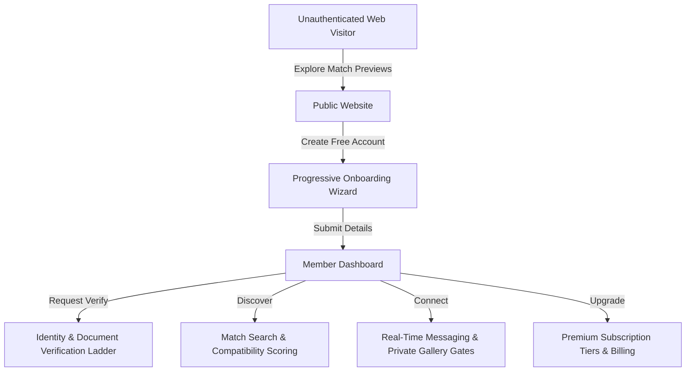

# 💍 Vivah Australia — Matrimonial Matchmaking Platform

<p align="center">
  
  
  
</p>

---

## 🌟 Positioning & Value Proposition

**Australia's Trusted Indian Matrimonial Platform**  
*Connecting Hearts. Creating Futures.*

Vivah Australia combines cultural traditions with modern technologies to help South Asian singles and families build meaningful, lifelong relationships. The platform is designed from the ground up to feel like **luxury wedding planning meets premium trusted matchmaking**, moving away from standard dating app interfaces.

---

## ✨ Features & Capabilities



### 🎨 Brand Identity Guidelines
*   **Deep Maroon** (`#A10E4D`): Primary brand highlight, CTA buttons, active state accents.
*   **Wedding Gold** (`#D4A04C`): Premium indicators, verification badges, secondary emphasizes.
*   **Soft Rose** (`#E74C7C`): Accent borders, hover transitions, highlights.
*   **Warm Ivory** (`#FFF9F5`): Canvas surfaces, page layout panels, cards.
*   **Charcoal** (`#2F2F2F`): High contrast readability, primary navigation text.

---

## 🗂️ Workspace Architecture

```text
├── apps
│   ├── web/             # Next.js 16.2 client-side portal, routing & components
│   └── api/             # Express API backend, business services & DB controllers
├── packages
│   ├── shared/          # Central types, validation schemas, enums, & configuration
│   ├── config/          # Common ESLint and TypeScript configs
│   └── ui/              # Shareable design primitives and styled components
├── docs/                # Architectural diagrams, audit history & rebrand plan
└── scripts/             # Route QA monitors & task list synchronization tools
```

---

## ⚙️ Quick Start

### Prerequisites
*   Node.js 22.x or higher
*   pnpm 10.x or higher
*   A running MongoDB instance (or local community server)

### 1. Installation
Install workspace dependencies at the root:
```bash
pnpm install
```

### 2. Environment Variables Configuration
Copy variables templates in the app folders:
```bash
cp apps/api/.env.example apps/api/.env
cp apps/web/.env.example apps/web/.env
```

### 3. Start Development Servers
Spin up both the Express API and Next.js portal simultaneously:
```bash
pnpm dev
```
*   **Web Portal**: `http://localhost:3000`
*   **Backend API**: `http://localhost:4000`
*   **Uptime Health Endpoint**: `http://localhost:4000/health`

---

## 🛠️ Operational Tasks & Command Lines

| Action | Command Line | Purpose |
| :--- | :--- | :--- |
| **Lint** | `pnpm lint` | Validates file formatting and code conventions. |
| **Typecheck** | `pnpm typecheck` | Checks TypeScript compilation validity across the monorepo. |
| **Test** | `pnpm test` | Triggers all Vitest integration and controller tests. |
| **Build** | `pnpm build` | Generates Next.js production builds and transpiles TypeScript. |
| **Route QA** | `pnpm route:qa` | Assesses response code 200 on all 46 system endpoints. |
| **Sync Tracker** | `node scripts/sync-tasks.js` | Generates backlog stats from local markdown checkmarks. |

---

## 🔒 Verification & Safety Standards
*   **WCAG AA Compliance**: High-contrast text matches a minimum ratio of 4.5:1 (Maroon on Ivory exceeds 7:1).
*   **Security & Encryption**: BCrypt hashed passwords, token rotation cookies, and gated media galleries.
*   **Moderation Auditing**: Every admin block, report triage, and verification badge change requires audit notes.
